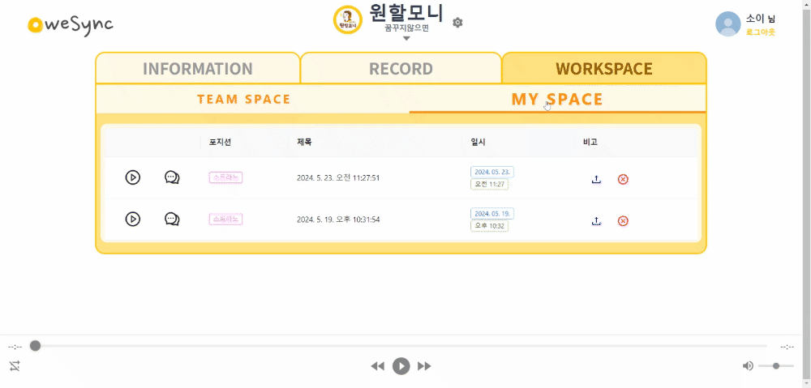
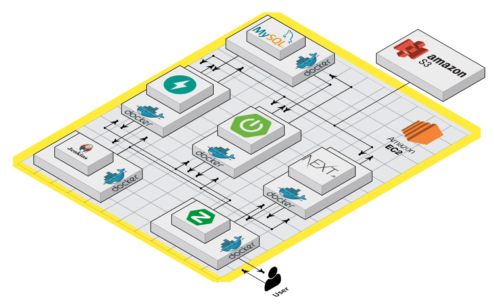
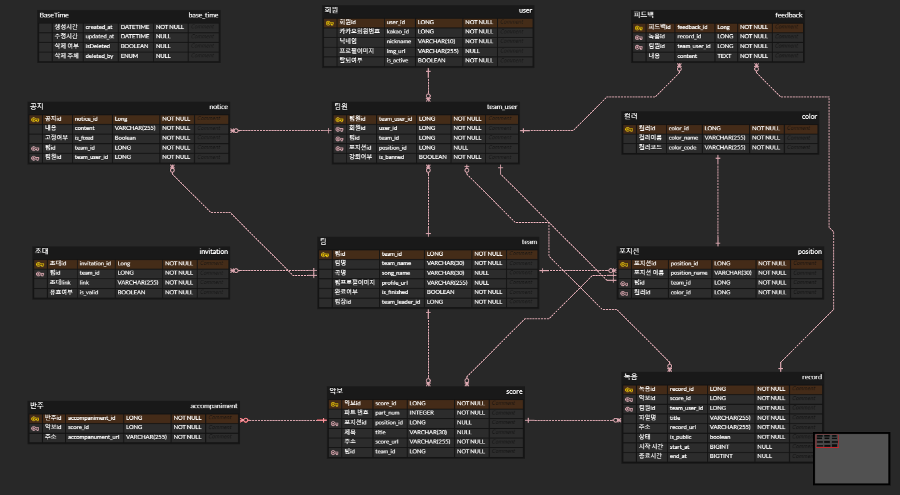
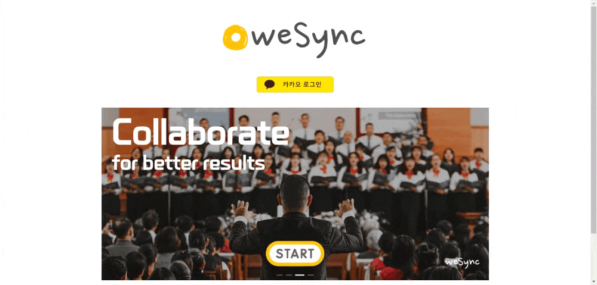

#  아카펠라 연습 스페이스 "weSync"

> 아카펠라 팀관리에 어려움이 있으신가요?📢 
팀연습이 끝난 후 집에서 개인연습까지 하고 싶으신가요?🎤 
weSync로 이 모든 고민을 해결해보세요!✅
  

## 🔗 소개영상
[UCC](https://drive.google.com/file/d/1kScbcJ66ZIOAQU7XDiMLnwCNyM7wiKO5/view?usp=drive_link)
  

## 🔔 핵심기능

### 🎼 악보변환

 
**weSync**는 여러 파트로 구성된 아카펠라 악보를 **파트별로 자동으로 분할**해 줍니다. 팀스페이스에서 하나의 악보가 업로드되면 다수의 파트별 악보를 생성하여 제공합니다.
  

### 🎹 반주재생

 
파트별 악보에는 **반주도 함께 제공**됩니다. 모든 파트를 동시 재생하여 완성된 멜로디를 듣거나 원하는 파트만 재생하여 정확한 음을 파악할 수 있습니다.
  

### 🎙️ 녹음

 
팀스페이스의 팀원들은 원하는 **파트별로 녹음**을 진행할 수 있습니다. 녹음한 결과물은 개인 **워크스페이스**에 저장됩니다.
  

## 🌐 개발 환경 및 기술 스택

### Front-End

### Back-End

### Database

### AI

### 버전 및 이슈관리

### 협업 툴

### CI/CD

### 디자인

  

## ⚙️ 아키텍처

  

## 🔑 ERD

  

## 🎶 사용설명서

#### 카카오 로그인

 
카카오로 회원가입을 진행하고 이미 회원가입한 사용자라면 바로 로그인이 가능합니다.
  

#### 팀 스페이스 생성

 
연습을 진행할 팀 스페이스를 생성합니다. 팀을 생성한 사용자가 방장이 됩니다.  
\* weSync의 모든 기능은 팀 스페이스에서 이용이 가능하며 팀 스페이스는 프로젝트(곡) 단위로 관리하는 것이 권장됩니다. 
  

#### 팀원 초대링크 생성

 
초대 링크를 생성하여 함께 연습 할 팀원들을 초대합니다. 초대 링크는 이틀 간 유효합니다.
  

#### 포지션 할당

 
각 사용자는 팀 스페이스에서 자신의 포지션을 지정할 수 있습니다. 또한 팀장 권한으로 타인의 포지션을 변경할 수 있습니다.
  

#### 팀 공지사항 관리

 
팀의 팀장은 팀 스페이스에서 공지사항을 작성하여 팀원들에게 정보를 전달합니다. 
\*팀의 팀장만이 공지사항을 등록, 고정, 삭제할 수 있습니다.
  

#### 악보 등록

 
팀 스페이스에서 연습할 아카펠라 악보를 업로드합니다.
  

#### 악보 변환

 
여러 포지션이 모두 반영되어있는 악보가 포지션별 악보로 자동으로 변환되어 제공됩니다.
  

#### 반주 재생

 
모든 포지션을 전체 재생하거나 각 포지션을 단일 재생하여 반주를 들을 수 있습니다.
  

#### 녹음

 
제공되는 반주에 맞추어 연습(녹음)을 하고 결과물을 팀 스페이스 내 개인 스페이스에 저장합니다.
  

#### 피드백 작성 및 녹음 공유  

 
녹음본을 팀에서 공유하여 팀원들에게 평가를 받아볼 수 있습니다.
  

## 📅 개발 기간 및 작업 관리

### 개발 기간

- 전체 개발 기간 : 2024-04-08 ~ 2024-05-20
- 기획 및 설계 : 2024-04-08 ~ 2024-04-21
- 기능 구현 : 2024-04-22 ~ 2024-05-17
- 테스트 및 수정 : 2024-05-18 ~ 2024-05-20
- 리팩토링 : 2024-05-21 ~ 2024-05-23
  

## 🙋‍♂️ Members
<table>
    <tr height="140px">
    <td align="center" width="60px">
            멤버
      </td>
      <td align="center" width="130px">
             이승연
      </td>
      <td align="center" width="130px">
             황인규
      </td>
      <td align="center" width="130px">
             명소이
      </td>
      <td align="center" width="130px">
             이병수
      </td>
      <td align="center" width="130px">
             김평섭
      </td>
     </tr>
    <tr>
        <td align="center" width="60px">
            역할
      </td>
       <td align="center" width="130px">
           팀장 / Frontend
       </td>
       <td align="center" width="130px">
           Frontend
       </td>
       <td align="center" width="130px">
         AI / Backend
       </td>
       <td align="center" width="130px">
         Infra / Backend
       </td>
       <td align="center" width="130px">
         Backend
       </td>
    </tr>
</table>
